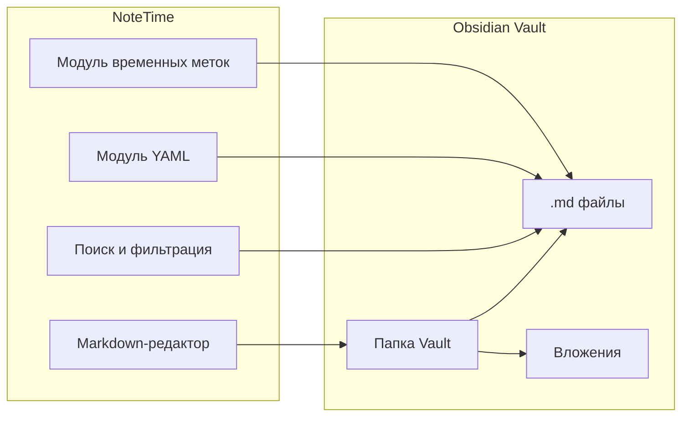
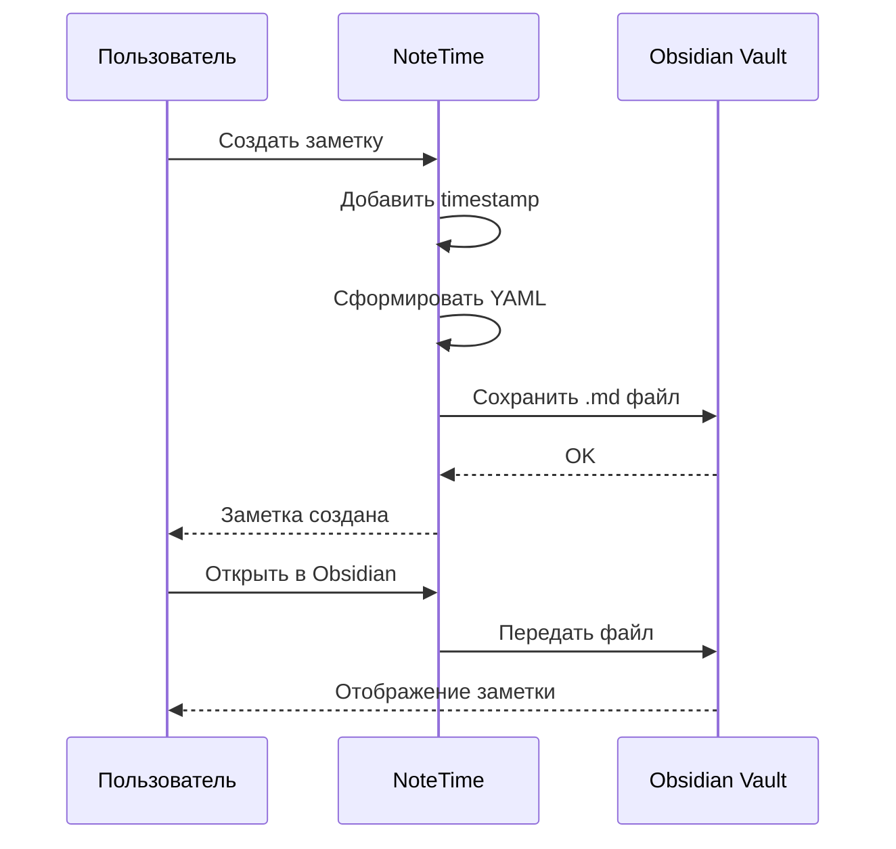
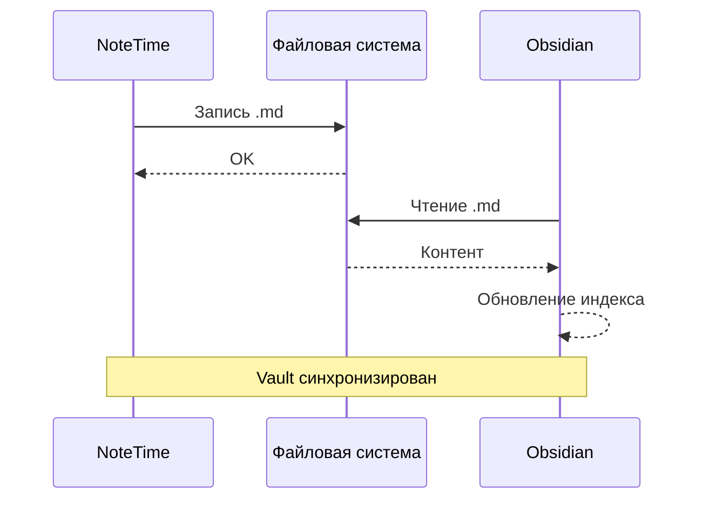

## Приложение 1. Схема интеграции с Obsidian



## Приложение 2. Пример YAML frontmatter

```yaml
---
title: Заметка NoteTime
created: 2026-09-21T14:30:00
modified: 2026-09-21T15:45:00
type: note
tags: [notetime, заметки, хронология]
time: 14:30
duration: 75
---
```

## Приложение 3. Пример структуры Vault

```
Vault/
├── Daily/
│   ├── 2026-09-21.md
│   └── 2026-09-22.md
├── Notes/
│   ├── NoteTime-001.md
│   └── NoteTime-002.md
├── Projects/
│   └── Project-A.md
├── Attachments/
│   └── image.png
└── .obsidian/
    └── config
```

## Приложение 4. Сценарий создания заметки



## Приложение 5. Сценарий синхронизации


